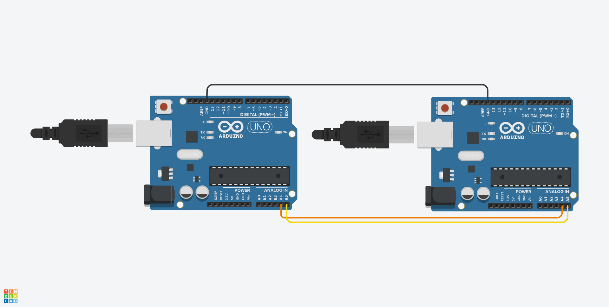

# 8b10b Encoder/Decoder

In this project, made as an assignment for the Communication Networks class, one Arduino (Uno, in this particular example) takes the data sent through the serial monitor, applies 8b10b encoding and send it via I2C. A second Arduino (also Uno) receives the 8b10b encoded data via I2C, decodes it and send via serial to be displayed on the serial monitor.

The magic lies in using lookup tables for quickly encoding/decoding all possible values in the protocol.

## Circuit

It is simply 2 Arduino Uno sharing a common GND and connecting I2C's SDA and SCL signals.

